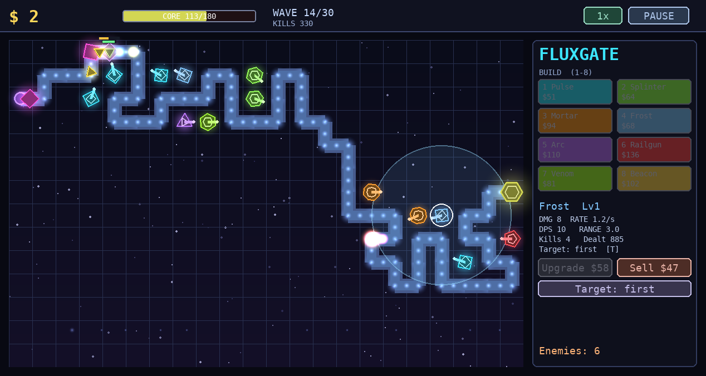

# Fluxgate

A **procedural neon tower-defense roguelite**. Defend your core from escalating
waves of geometric enemies marching along a procedurally generated path. Build
and upgrade eight distinct tower types, pick roguelite augments between waves,
and survive thirty waves of exponential pressure — then keep going in endless.

Every visual is **generated at runtime** (glow textures from a numpy falloff,
computed n-gon silhouettes, gradients, particles, a generated starfield) — there
are no art assets anywhere in the repo.



## What makes it tick

The whole thing is built around a hard split between **simulation** and
**rendering**:

- **`fluxgate/core/`** — a pure-stdlib, fully deterministic simulation. A single
  integer seed fixes the map, the waves, and every combat roll. No pygame, no
  numpy — just the tick loop.
- **`fluxgate/render/`** — a pygame *view* of the sim that never mutates it.
- **`fluxgate/ai/`** — a heuristic AI player (reasonable, not optimal).
- **`fluxgate/sim/`** — a headless balance harness that runs the AI across
  hundreds of seeds and reports win rates, difficulty curves, and economy.

Because the GUI and the harness drive the *same* `GameState` through the same
fixed-timestep `tick(DT)`, **what is balance-tested headlessly is exactly what
you play.**

## Running it

```bash
python -m venv .venv && . .venv/bin/activate
pip install -r requirements.txt

python main.py                      # launch the GUI (needs a display)
python main.py --seed 42 --difficulty hard
python main.py --smoke 300          # headless render check (dummy video, no window)
```

### Controls

| Input | Action |
|-------|--------|
| `1`-`8` / click palette | select a tower to build, then click a tile |
| click a tower | inspect it; `U` upgrade, `S` sell, `T` cycle targeting |
| `Space` | start the next wave |
| `Tab` | cycle game speed (1x / 2x / 3x) |
| `P` | pause · `ESC` cancel / back to menu · `H` help |
| `1`/`2`/`3` | pick the offered augment between waves |

## Verifying balance headlessly

```bash
python -m fluxgate.sim.balance --all --games 60     # AI win rate per difficulty
python -m fluxgate.sim.balance --towers             # tower DPS table
python -m fluxgate.sim.balance --enemies            # enemy HP-by-wave table
pytest -q                                           # 31 logic + render-smoke tests
```

Measured heuristic-AI win rates (the AI is a competent baseline, so skilled
humans do better and the median player is genuinely challenged):

| Difficulty | AI win rate | where runs end |
|-----------|-------------|----------------|
| easy      | ~100%       | clears 30      |
| normal    | ~65%        | waves 24–30    |
| hard      | ~10%        | waves 11–28    |
| insane    | ~0%         | waves 11–24    |

Difficulty steepens the *growth curve* rather than applying a flat multiplier,
so every tier opens at a learnable pace and only diverges in the late game.

## Design notes

The central balance insight: enemy **count** growth must stay flat while enemy
**HP** growth is steep. If both grow, kill-income explodes, funding unlimited
towers — a runaway feedback loop where harder waves make the game *easier*.
Keeping count flat bounds the affordable arsenal while EHP outpaces achievable
DPS, which is what creates a real late-game crunch (see `fluxgate/core/config.py`).

Content for depth: 8 towers × upgrade tiers, 10 enemy archetypes (armor,
shields, regen, healers, splitters, phase, bosses), 16 augments, 30 waves +
endless, 4 difficulties, and a fresh procedural map every seed.
